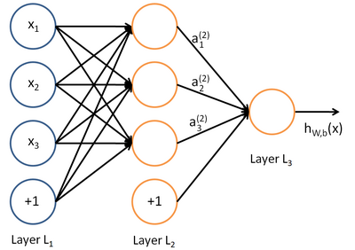

# 1.感知器

## 深度学习是啥
在人工智能领域，有一个方法叫机器学习。在机器学习这个方法里，有一类算法叫神经网络。神经网络如下图所示：

上图中每个圆圈都是一个神经元，每条线表示神经元之间的连接。我们可以看到，上面的神经元被分成了多层，层与层之间的神经元有连接，而层内之间的神经元没有连接。最左边的层叫做**输入层**，这层负责接收输入数据；最右边的层叫**输出层**，我们可以从这层获取神经网络输出数据。输入层和输出层之间的层叫做**隐藏层**。

隐藏层比较多（大于2）的神经网络叫做深度神经网络。而深度学习，就是使用深层架构（比如，深度神经网络）的机器学习方法。

那么深层网络和浅层网络相比有什么优势呢？简单来说深层网络能够表达力更强。事实上，一个仅有一个隐藏层的神经网络就能拟合任何一个函数，但是它需要很多很多的神经元。而深层网络用少得多的神经元就能拟合同样的函数。也就是为了拟合一个函数，要么使用一个浅而宽的网络，要么使用一个深而窄的网络。而后者往往更节约资源。

深层网络也有劣势，就是它不太容易训练。简单的说，你需要大量的数据，很多的技巧才能训练好一个深层网络。这是个手艺活。

### 2）感知器

看到这里，如果你还是一头雾水，那也是很正常的。为了理解神经网络，我们应该先理解神经网络的组成单元——**神经元**。神经元也叫做**感知器**。感知器算法在上个世纪50-70年代很流行，也成功解决了很多问题。并且，感知器算法也是非常简单的。

感知器的定义
